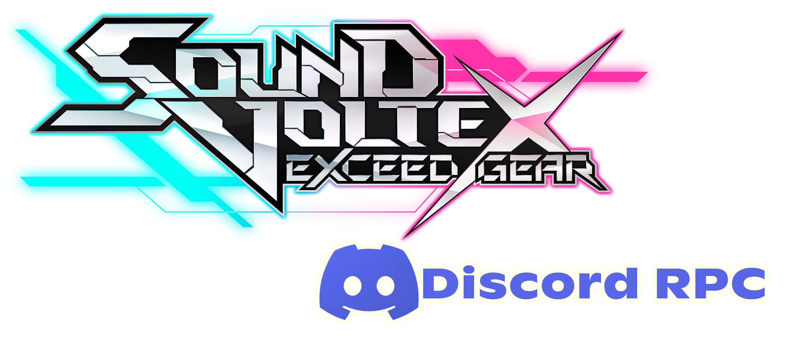

# 🩵🩷 SDVX Rich Presence Launcher


<p align="center">
  
</p>

A fully automatic **Discord Rich Presence** integration for **Sound Voltex Exceed Gear** (Spice2x).
No memory reading. No manual setup. Just launch and play.

## ✨ Features

* 🚀 **Auto-Launcher:** Opens `spice64.exe` for you.
* 🔎 **Detection:** Detects Song Title, Play Mode (Light/Standard/Premium), and Hexa Diver.

## 📥 Installation

1.  Go to the [**Releases Page**](https://github.com/Oscript07/SDVX-Rich-Presence/releases) and download `SDVX_Launcher.exe`.
2.  Place the `.exe` file inside your game folder (same folder as `spice64.exe`).

## ❓ How to use

1.  Run **`SDVX_Launcher.exe`** (Admin rights required to read game logs to update Discord status).
2.  The game will start automatically.
3.  **As you move in the song selection** it will sync your status.
4.  Enjoy! Discord will update automatically.

## 🛠️ Building from source

If you want to modify the code or build it yourself:

```bash
pip install pypresence pyinstaller
pyinstaller --onefile --uac-admin --name "SDVX_Launcher" sdvx_rpc.py
